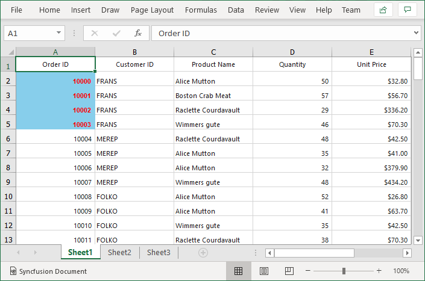

# How to format cells in the exported excel document based on the value of another cell in same row in WinForms DataGrid(SfDataGrid)?

## About the sample

This sample illustrates how to format cells in the exported excel document based on the value of another cell in same row in SfDataGrid.

[WinForms DataGrid](https://www.syncfusion.com/winforms-ui-controls/datagrid) (SfDataGrid) allows you to format cells in the exported excel document based on the value of another cell in same row by using [ExcelExportingOptions.CellExporting](https://help.syncfusion.com/cr/windowsforms/Syncfusion.WinForms.DataGridConverter.ExcelExportingOptions.html#Syncfusion_WinForms_DataGridConverter_ExcelExportingOptions_CellExporting) event. 

```C#

Var options = new ExcelExportingOptions();
options.CellExporting += OnCellExporting;
var excelEngine = sfDataGrid1.ExportToExcel(sfDataGrid1.View, options);
var workBook = excelEngine.Excel.Workbooks[0];
workBook.SaveAs("Sample.xlsx");

private void OnCellExporting(object sender, Syncfusion.WinForms.DataGridConverter.Events.DataGridCellExcelExportingEventArgs e)
{
    var record = e.NodeEntry as OrderInfo;

    // Style for OrderID column is changed based on the values in CustomerID column
    if(e.ColumnName == "OrderID")
    {
        if(record != null && record.CustomerID == "FRANS")
        {
            e.Range.CellStyle.Color = Color.SkyBlue;
            e.Range.CellStyle.Font.Color = ExcelKnownColors.Red;
            e.Range.CellStyle.Font.FontName = "Arial";
            e.Range.CellStyle.Font.Bold = true;
        }
    }
}

```



## Requirements to run the demo

Visual Studio 2015 and above versions